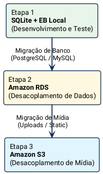

!!! info "Objetivo do Roteiro"
    Este roteiro orienta a criação de um **projeto Django REST inicial com SQLite**, configurado especificamente para rodar com alta estabilidade no **AWS Elastic Beanstalk (plataforma Python 3.12)**. A arquitetura foi desenhada de forma desacoplada para facilitar migrações futuras para **Amazon RDS (PostgreSQL/MySQL)** e **Amazon S3 (mídia/arquivos estáticos)**.

---

## Parte 0: Configuração do Ambiente Local

### Passo 1: Instalar Python 3.12+

1. Certifique-se de ter o **Python 3.12 ou superior** instalado.
2. Verifique a versão no seu terminal:

```bash
python --version
```

### Passo 2: Preparar o VS Code

1. Abra o Visual Studio Code.
2. No menu de **Extensions** (`Ctrl+Shift+X`), instale:
    - **Python** (*Microsoft*)
    - **Pylance** (*Microsoft*)

### Passo 3: Criar a pasta do projeto

```bash
mkdir catalogo-produtos
cd catalogo-produtos
code .
```

### Passo 4: Criar e ativar o ambiente virtual

=== "Linux / macOS"
    ```bash
    python -m venv .venv
    source .venv/bin/activate
    ```

=== "Windows (PowerShell)"
    ```powershell
    python -m venv .venv
    .venv\Scripts\Activate.ps1
    ```

### Passo 5: Selecionar o interpretador no VS Code

1. Pressione <kbd>Ctrl</kbd> + <kbd>Shift</kbd> + <kbd>P</kbd> (ou <kbd>Cmd</kbd> + <kbd>Shift</kbd> + <kbd>P</kbd> no macOS).
2. Digite e selecione: `Python: Select Interpreter`.
3. Escolha o interpretador correspondente à pasta `.venv`.

### Passo 6: Instalar dependências iniciais

```bash
pip install django djangorestframework pillow gunicorn
```

### Passo 7: Criar projeto Django e aplicativo REST

```bash
django-admin startproject catalogo .
python manage.py startapp produtos
```

### Passo 8: Inicializar banco local e validar subida

```bash
python manage.py migrate
python manage.py runserver
```

!!! success "Validação Local"
    Acesse no seu navegador:
    
    - Aplicação: [http://127.0.0.1:8000/](http://127.0.0.1:8000/)
    - Painel Admin: [http://127.0.0.1:8000/admin/](http://127.0.0.1:8000/admin/)

---

## Parte 1: Estrutura do Projeto e Código-Fonte

### Passo 1: Estrutura de Diretórios Recomendada

Organize a raiz do seu projeto conforme a árvore abaixo para garantir compatibilidade com o Elastic Beanstalk:

```text title="Estrutura de Pastas do Projeto"
catalogo-produtos/
├── .ebextensions/
│   ├── django.config
│   └── detection.config
├── .elasticbeanstalk/
│   └── config.yml
├── static/
├── media/
├── requirements.txt
├── Procfile
├── catalogo/
│   ├── __init__.py
│   ├── settings.py
│   ├── urls.py
│   ├── wsgi.py
│   └── asgi.py
└── produtos/
    ├── __init__.py
    ├── admin.py
    ├── apps.py
    ├── models.py
    ├── serializers.py
    ├── views.py
    └── urls.py
```

### Passo 2: Configurações do Django (`settings.py`)

Edite o arquivo `catalogo/settings.py` com as configurações preparadas para ambiente local e nuvem:

```python title="catalogo/settings.py"
import os
from pathlib import Path

BASE_DIR = Path(__file__).resolve().parent.parent

# Configuração de DEBUG - False em produção no Elastic Beanstalk
DEBUG = True if os.getenv('DJANGO_DEBUG', 'True') == 'True' else False

# Hosts permitidos (essencial para o Elastic Beanstalk)
ALLOWED_HOSTS = os.getenv(
    'DJANGO_ALLOWED_HOSTS',
    'localhost,127.0.0.1,.elasticbeanstalk.com'
).split(',')

# Configuração do Banco de Dados
DATABASES = {
    'default': {
        'ENGINE': 'django.db.backends.sqlite3',
        'NAME': BASE_DIR / 'db.sqlite3',
    }
}

# Configuração de Arquivos de Mídia (Uploads)
if DEBUG:
    # Armazenamento local durante o desenvolvimento
    MEDIA_URL = '/media/'
    MEDIA_ROOT = os.path.join(BASE_DIR, 'media')
else:
    # Arquitetura preparada para ativação posterior do AWS S3
    USE_S3 = os.getenv('USE_S3', 'False') == 'True'
    if USE_S3:
        pass
    else:
        MEDIA_URL = '/media/'
        MEDIA_ROOT = os.path.join(BASE_DIR, 'media')

# Configuração de Arquivos Estáticos
STATIC_URL = '/static/'
STATIC_ROOT = BASE_DIR / 'staticfiles'
```

### Passo 3: Modelo de Dados (`models.py`)

```python title="produtos/models.py"
from django.db import models

class Produto(models.Model):
    nome = models.CharField(max_length=200)
    descricao = models.TextField()
    preco = models.DecimalField(max_digits=10, decimal_places=2)
    imagem = models.ImageField(upload_to='produtos/', blank=True, null=True)
    data_criacao = models.DateTimeField(auto_now_add=True)

    def __str__(self):
        return self.nome
```

### Passo 4: Serializer, ViewSet e URLs da API

```python title="produtos/serializers.py"
from rest_framework import serializers
from .models import Produto

class ProdutoSerializer(serializers.ModelSerializer):
    class Meta:
        model = Produto
        fields = ['id', 'nome', 'descricao', 'preco', 'imagem', 'data_criacao']
```

```python title="produtos/views.py"
from rest_framework import viewsets
from .models import Produto
from .serializers import ProdutoSerializer

class ProdutoViewSet(viewsets.ModelViewSet):
    queryset = Produto.objects.all()
    serializer_class = ProdutoSerializer
```

```python title="produtos/urls.py"
from django.urls import include, path
from rest_framework.routers import DefaultRouter
from .views import ProdutoViewSet

router = DefaultRouter()
router.register(r'produtos', ProdutoViewSet)

urlpatterns = [
    path('', include(router.urls)),
]
```

```python title="catalogo/urls.py"
from django.contrib import admin
from django.http import JsonResponse
from django.urls import path, include
from django.conf import settings
from django.conf.urls.static import static

def healthcheck(_request):
    """Endpoint de health check essencial para o Elastic Beanstalk (retorna status 200)"""
    return JsonResponse({'status': 'ok'})

urlpatterns = [
    path('', healthcheck),  # Rota raiz monitorada pelo load balancer / health check do EB
    path('admin/', admin.site.urls),
    path('api/', include('produtos.urls')),
]

# Servir arquivos de mídia em modo de desenvolvimento
if settings.DEBUG:
    urlpatterns += static(settings.MEDIA_URL, document_root=settings.MEDIA_ROOT)
```

---

## Parte 2: Arquivos de Configuração do Elastic Beanstalk

### Passo 1: Arquivos `.ebextensions` e `Procfile`

Crie o diretório `.ebextensions/` na raiz do projeto e adicione os seguintes arquivos:

```yaml title=".ebextensions/detection.config"
# Garante a detecção correta da plataforma Python
option_settings:
  aws:elasticbeanstalk:application:environment:
    AWS_EB_PLATFORM_DETECTION: "python"
    AWS_EB_PLATFORM_OVERRIDE: "Python 3.12"
```

```yaml title=".ebextensions/django.config"
option_settings:
  aws:elasticbeanstalk:container:python:
    WSGIPath: catalogo/wsgi.py
  aws:elasticbeanstalk:application:environment:
    DJANGO_SETTINGS_MODULE: catalogo.settings
    DJANGO_DEBUG: False
  aws:elasticbeanstalk:environment:proxy:staticfiles:
    /static: staticfiles
    /media: media

container_commands:
  01_migrate:
    command: "python manage.py migrate --noinput"
    leader_only: true
  02_collectstatic:
    command: "python manage.py collectstatic --noinput"
    leader_only: true
  03_create_media_dir:
    command: "mkdir -p media/produtos"
  04_permissao_arquivo_sqlite:
    command: "chmod 666 db.sqlite3"
  05_permissao_pasta_sqlite:
    command: "chmod 777 ."
```

```text title="Procfile"
web: gunicorn catalogo.wsgi:application --bind 127.0.0.1:8000
```

```yaml title=".elasticbeanstalk/config.yml"
branch-defaults:
  main:
    environment: null
    group_suffix: null
environment-defaults: {}
deploy:
  artifact: app.zip
global:
  application_name: catalogo-produtos
  default_platform: Python 3.12
  default_region: us-east-1
  include_gitid: yes
  instance_profile: null
  platform_name: null
  platform_version: null
  profile: eb-cli
  sc: git
  workspace_type: Application
```

### Passo 2: Dependências do Projeto (`requirements.txt`)

```text title="requirements.txt"
asgiref==3.11.1
Django==6.0.4
djangorestframework==3.17.1
pillow==12.2.0
sqlparse==0.5.5
tzdata==2026.1
gunicorn==21.2.0
# psycopg2-binary==2.9.9  # Para futura migração para RDS
# boto3==1.28.56          # Para futura migração para S3
# django-storages==1.13.3 # Para futura migração para S3
```

### Passo 3: Variáveis de Ambiente no Console EB

!!! warning "Importante: Configuração de Variáveis"
    No primeiro deploy, o Elastic Beanstalk **não infere automaticamente** variáveis como `DJANGO_ALLOWED_HOSTS` do arquivo `settings.py`.
    
    Acesse no console AWS: **Configuration** $\to$ **Software** $\to$ **Environment properties** e defina:
    
    - `DJANGO_DEBUG` = `False`
    - `DJANGO_ALLOWED_HOSTS` = `<seu-dominio-eb>,.elasticbeanstalk.com`

---

## Parte 3: Teste Local Completo

Antes de realizar o empacotamento para a AWS, valide o funcionamento local completo:

=== "Linux / macOS"
    ```bash
    # Ativação do ambiente e instalação
    source .venv/bin/activate
    pip install -r requirements.txt

    # Aplicação das migrações e superusuário
    python manage.py migrate
    python manage.py createsuperuser

    # Execução local
    python manage.py runserver
    ```

=== "Windows (PowerShell)"
    ```powershell
    # Ativação do ambiente e instalação
    .venv\Scripts\Activate.ps1
    pip install -r requirements.txt

    # Aplicação das migrações e superusuário
    python manage.py migrate
    python manage.py createsuperuser

    # Execução local
    python manage.py runserver
    ```

!!! check "Roteiro de Validação Rápida"
    1. Acesse [http://localhost:8000/admin/](http://localhost:8000/admin/) e realize o login com o superusuário criado.
    2. Acesse [http://localhost:8000/api/produtos/](http://localhost:8000/api/produtos/) e verifique o retorno JSON vazio `[]`.
    3. Teste o cadastro de um produto com foto via interface navegável da API ou pelo Admin.

---

## Parte 4: Deploy no AWS Elastic Beanstalk

### Passo 0: Permissões IAM para Deploy

1. Acesse o **AWS IAM Console** $\to$ **Users**.
2. Selecione o usuário que executará o deploy.
3. Clique em **Add permissions** $\to$ **Attach policies directly** e vincule:
    - `AdministratorAccess-AWSElasticBeanstalk`

### Passo 1: Preparar o Pacote ZIP para Deploy

!!! danger "Atenção Crítica aos Arquivos do ZIP"
    - Os arquivos e pastas (`.ebextensions`, `catalogo`, `produtos`, `Procfile`, `requirements.txt`, etc.) devem estar na **raiz do arquivo ZIP**, sem uma pasta pai englobando tudo.
    - **NÃO inclua no arquivo ZIP:**
        - Pastas virtuais: `.venv/` ou `venv/`
        - Banco local: `db.sqlite3`
        - Versionamento: `.git/` ou `.gitignore`
        - Caches: pastas `__pycache__/`
        - Arquivos locais de segredo: `.env`

### Passo 2: Assistente de Criação da Aplicação

1. Acesse **Elastic Beanstalk** no AWS Console e clique em **Create Application**.
2. Preencha os campos básicos:
    - **Application name**: `catalogo-produtos`
    - **Description**: `Catálogo de produtos - API Django REST`
3. Na seção **Platform**:
    - **Platform**: `Python`
    - **Platform branch**: `Python 3.12 running on 64bit Amazon Linux 2023`
4. Na seção **Application code**:
    - Selecione **Upload your code**.
    - Em **Source code origin**, escolha **Local file** e faça o upload do seu `app.zip`.

### Passo 3: Criar e Acompanhar o Ambiente

1. Clique em **Next / Create application**.
2. Aguarde de **6 a 10 minutos** enquanto o Elastic Beanstalk provisiona a instância EC2, grupos de segurança e executa o deployment.
3. No painel do ambiente, acompanhe até que o **Health** fique com status **OK (Verde)**.
4. Clique no **Domain** (link do ambiente) para testar a aplicação em produção.

---

## Parte 5: Caminho para Migrações Futuras



???+ note "Guia de Migração: Amazon RDS (PostgreSQL / MySQL)"
    Quando for migrar o armazenamento relacional para o RDS gerenciado:
    
    1. **Criar a instância RDS** (PostgreSQL ou MySQL) na mesma VPC do Elastic Beanstalk.
    2. **Configurar as variáveis de ambiente** no Elastic Beanstalk (Software Configuration):
        - `RDS_DB_NAME` = `<nome_banco>`
        - `RDS_USERNAME` = `<usuario>`
        - `RDS_PASSWORD` = `<senha>`
        - `RDS_HOSTNAME` = `<endpoint_rds>`
        - `RDS_PORT` = `5432` (PostgreSQL) ou `3306` (MySQL)
    3. **Atualizar dependências**: descomentar `psycopg2-binary` no `requirements.txt`.
    4. **Remover referência ao arquivo `db.sqlite3`** e aplicar migrações diretamente na instância.

???+ note "Guia de Migração: Amazon S3 (Upload de Arquivos e Fotos)"
    Quando for transferir o upload de mídias para um bucket S3:
    
    1. **Criar o bucket S3** com permissões adequadas.
    2. **Descomentar dependências** no `requirements.txt` (`boto3` e `django-storages`).
    3. **Definir variáveis de ambiente no EB**:
        - `USE_S3` = `True`
        - `AWS_ACCESS_KEY_ID` = `<sua_key>`
        - `AWS_SECRET_ACCESS_KEY` = `<sua_secret>`
        - `AWS_STORAGE_BUCKET_NAME` = `<nome_bucket>`
        - `AWS_S3_REGION_NAME` = `us-east-1`
    4. **Ativar o bloco de configuração S3 no `catalogo/settings.py`**:
        ```python title="catalogo/settings.py (Configuração S3)"
        if not DEBUG and USE_S3:
            AWS_S3_ADDRESSING_STYLE = "virtual"
            AWS_S3_FILE_OVERWRITE = False
            AWS_DEFAULT_ACL = None
            AWS_QUERYSTRING_AUTH = False
            AWS_S3_SIGNATURE_VERSION = 's3v4'
            
            AWS_S3_CUSTOM_DOMAIN = f'{AWS_STORAGE_BUCKET_NAME}.s3.{AWS_S3_REGION_NAME}.amazonaws.com'
            MEDIA_URL = f'https://{AWS_S3_CUSTOM_DOMAIN}/media/'
            DEFAULT_FILE_STORAGE = 'storages.backends.s3boto3.S3Boto3Storage'
        ```

---

## Checklist Final de Deploy

Antes de iniciar a criação do ambiente no Elastic Beanstalk, valide cada um dos itens abaixo:

- [ ] **1. Plataforma**: Selecionada explicitamente como **Python 3.12**.
- [ ] **2. Dependências**: Arquivo `requirements.txt` com `Django`, `djangorestframework` e `gunicorn`.
- [ ] **3. Procfile**: Criado na raiz com a instrução `web: gunicorn catalogo.wsgi:application --bind 127.0.0.1:8000`.
- [ ] **4. Configuração EB**: `.ebextensions/django.config` contendo `WSGIPath`, `DJANGO_SETTINGS_MODULE` e os `container_commands` (`migrate` + `collectstatic`).
- [ ] **5. Health Check**: `catalogo/urls.py` possui a rota raiz `/` retornando status HTTP `200`.
- [ ] **6. Configuração de Hosts**: `catalogo/settings.py` utiliza `DJANGO_ALLOWED_HOSTS` configurável.
- [ ] **7. Variáveis no EB**: `DJANGO_DEBUG=False` e `DJANGO_ALLOWED_HOSTS` configurados no Console AWS.
- [ ] **8. Estrutura do ZIP**: Arquivos empacotados a partir da raiz (sem pasta pai) e sem `.venv/`, `.git/`, `db.sqlite3` e `__pycache__/`.
- [ ] **9. Permissões IAM**: Usuário com política `AdministratorAccess-AWSElasticBeanstalk`.
- [ ] **10. Status Operacional**: Ambiente com Health **OK (Verde)** e respostas válidas nas rotas `/` e `/api/produtos/`.

